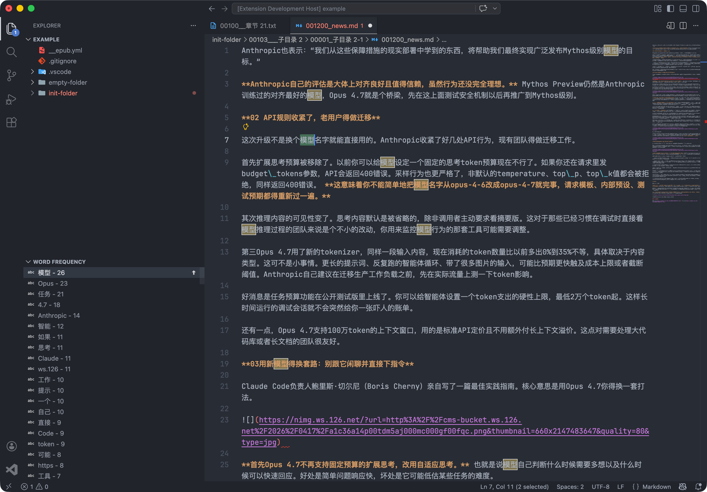

# Chinese Word Frequency (VS Code Extension)

在 Explorer 下新增“词频分析”面板，一键分析当前活动编辑器中的中文词频，并支持高亮与跳转。



## 功能概览

- Explorer 下新增视图：`词频分析`
- 视图按钮：
  - `分析`：分析当前活动编辑器
  - `清除`：清空词频列表
- 词频结果格式：`字词 - 次数`
- 排序规则：按出现次数降序；次数相同按词语字典序
- 过滤规则：
  - 忽略单字词（词长 `< 2`）
  - 仅展示出现次数 `> 1` 的词语
  - 忽略词配置支持 `User + Workspace + Workspace Folder` 合并并去重
- 分词引擎可切换：`segmentit` / `jieba`
- 词条交互：
  - 点击词条：高亮全部匹配，并向下跳转到下一个匹配
  - 点击词条右侧 `Up` 按钮：向上反向跳转
  - 重复点击同一词条会在该词所有匹配位置之间循环跳转
- 高亮行为：
  - 当前激活匹配使用绿色背景
  - 其他匹配使用 VS Code 查找高亮主题色
  - 按 `Esc` 可清除全部高亮
- i18n：支持英文与简体中文

## 使用方式

1. 打开并聚焦一个中文文本编辑器。
2. 在 Explorer 的“词频分析”视图点击 `分析`。
3. 点击任一词条进行高亮和跳转。
4. 需要反向跳转时，点击该词条右侧 `Up` 图标。
5. 点击 `清除` 或在编辑器按 `Esc` 清除高亮；`清除` 还会清空词频列表。

## 配置

### `wordFrequency.ignoreTerms`

- 类型：`string[]`
- 默认：`[]`
- 说明：统计时要忽略的词语，一项一个词
- 合并规则：`User + Workspace + Workspace Folder` 自动合并、`trim`、去重

### `wordFrequency.maxResults`

- 类型：`number`
- 默认：`300`
- 最小值：`10`
- 说明：词频面板最多展示条目数

### `wordFrequency.tokenizerEngine`

- 类型：`"segmentit" | "jieba"`
- 默认：`"segmentit"`
- 说明：切换中文分词实现，便于对比效果并按需回退

配置示例：

```json
{
  "wordFrequency.ignoreTerms": [
    "的",
    "了",
    "以及"
  ],
  "wordFrequency.maxResults": 300,
  "wordFrequency.tokenizerEngine": "jieba"
}
```

## 本地开发

```bash
npm install
npm run compile
```

调试：在 VS Code 中按 `F5` 启动 `Extension Development Host`。

打包：

```bash
npm run package
```
